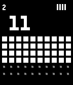
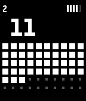
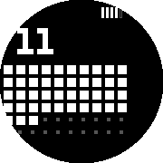
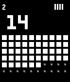
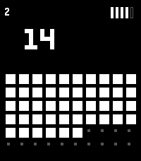
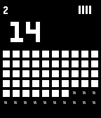

# covetous
my first pebble watch face

## genesis

i really like the watch face on the `Pebble 2 Duo` screenshot from [repebble.com/watch](https://repebble.com/watch)

but i couldn't figure out which face it was, so this is an attempt to build our own version of it.

## elements

| position     | description                          |
|--------------|--------------------------------------|
| upper left   | day of the month                     |
| center left  | hour of the day                      |
| lower center | 10x6 grid showing minute of the hour |
| upper right  | watch battery %                      |

- **Day of Month** (upper left) - Displayed in small dot-matrix style
- **Hour** (center-left) - Large pixelated 24-hour format
- **Minute Grid** (below hour) - 10x6 grid where filled squares show elapsed minutes
- **Battery** (upper right) - 5 vertical bars, each representing 20% charge

## screenshots

| platform  | screenshot                                |
|-----------|-------------------------------------------|
| `aplite`  |    |
| `basalt`  |    |
| `chalk`   |      |
| `diorite` |  |
| `emery`   |      |
| `flint`   |      |

it looks right on a Duo 2, but the `chalk` and `emery` implementations don't take the different dimensions in to account and are not right. will fix this in the future
